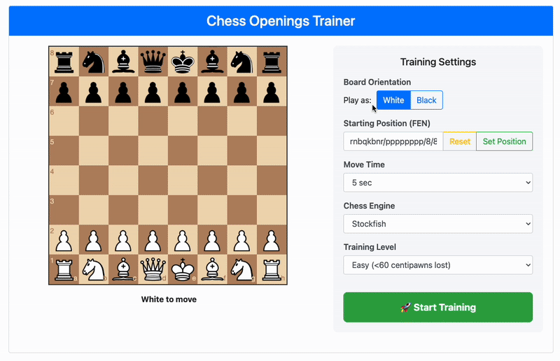

# Debut-Memorizer



A sophisticated chess opening trainer that helps you master chess debuts through real-time evaluation and adaptive difficulty. Train against realistic opponent moves sourced from Lichess database while receiving instant feedback from powerful chess engines.

## 🏷️ Technologies


[](https://stockfishchess.org/)
[](https://lczero.org/)
[](https://lichess.org/)
[](https://python-chess.readthedocs.io/)
[](https://flask.palletsprojects.com/)
[](https://www.postgresql.org/)


## 🎯 How It Works

Debut-Memorizer creates an immersive chess training experience by:

1. **Real Player Simulation**: Uses statistical data from Lichess to simulate realistic opponent moves
2. **Engine Evaluation**: Analyzes your moves using Stockfish or LC0 engines
3. **Adaptive Difficulty**: Three difficulty levels with different tolerance thresholds:
   - **Easy**: <60 centipawns lost
   - **Normal**: <30 centipawns lost  
   - **Hard**: <20 centipawns lost
4. **Time-Based Scoring**: 5-minute timer with -30 second penalties for mistakes
5. **Smart Scoring System**: Uses formula `t - diff` where `t` is tolerance and `diff` is evaluation difference

## 🚀 Quick Start

### Prerequisites

- Python 3.13+
- PostgreSQL database
- Stockfish chess engine
- LC0 chess engine (optional)
- Lichess game database (PGN format)

### Installation

1. **Clone the repository**
   ```bash
   git clone <repository-url>
   cd Debut-Memorizer
   ```

2. **Install dependencies**
   ```bash
   pip install -e .
   ```

3. **Set up environment variables**
   ```bash
   cp .env.example .env
   # Edit .env with your configuration
   ```

4. **Configure your .env file**
   ```env
   STOCKFISH_PATH=/path/to/stockfish
   LCZERO_PATH=/path/to/lc0
   LCZERO_WEIGHTS=/path/to/weights.pb.gz
   EXPLORER_CACHE_PATH=/path/to/cache
   
   POSTGRES_USER=your_username
   POSTGRES_PASSWORD=your_password
   POSTGRES_DB=debut_memorizer
   ```

5. **Start PostgreSQL database**
   ```bash
   docker-compose up -d
   ```

6. **Download the latest Lichess database**
   ```bash
   wget https://database.lichess.org/standard/lichess_db_standard_rated_YYYY-MM.pgn.zst
   unzstd lichess_db_standard_rated_YYYY-MM.pgn.bz2
   ```

7. **Ingest Lichess games**
   ```bash
   cd src
   python -m db.ingest --total=N /path/to/tolichess_db_standard_rated_YYYY-MM.pgn
   ```

8. **Cache move distributions with `explorer.py`**
   ```bash
   python -m explorer --depth=7 --stop_threshold=0.05
   ```

## 🎮 Usage

### Basic Training Session

1. **Start the application**
   ```bash
   cd src
   python -m app
   ```

2. **Open your browser**
   Navigate to `http://localhost:5000`

3. **Configure training**
   - Choose your color (White/Black)
   - Select engine (Stockfish/LC0)
   - Set difficulty level (Easy/Normal/Hard)
   - Choose engine thinking time

4. **Set up position**
   - Set up any starting position on the board
   - Ensure it's the engine's turn to move

5. **Start training**
   - Click "Start Training"
   - You have 5 minutes to achieve maximum score
   - Wrong moves result in -30 second penalty
   - Training restarts when no more realistic moves are available

### Scoring System

- **Score Formula**: `tolerance - |evaluation_difference|`
- **Tolerance Levels**:
  - Easy: -60 centipawns
  - Normal: -30 centipawns
  - Hard: -20 centipawns
- **Penalties**: -30 seconds for moves exceeding tolerance
- **Goal**: Maximize accumulated score within 5 minutes

## 🔧 Advanced Features

### Engine Arena
Compare different engine configurations:
```bash
cd src
python -m arena
```

### Database Explorer
Pre-cache more move distributions:
```bash
cd src
python explorer.py --depth 4 --stop-threshold 0.01
```

### Custom Engine Configuration
Edit `config/arena.yaml` to configure engine parameters and time controls.

## 📁 Project Structure

```
Debut-Memorizer/
├── src/
│   ├── app.py              # Flask web application
│   ├── engine.py           # Chess engine interfaces
│   ├── explorer.py         # Lichess database explorer
│   ├── eval.py             # Move evaluation logic
│   ├── arena.py            # Engine comparison tool
│   ├── db/                 # Database models and import
│   ├── static/             # Web assets
│   └── templates/          # HTML templates
├── config/
│   └── arena.yaml          # Engine configuration
├── readme/
│   └── demo.gif            # Demo animation
├── docker-compose.yml      # PostgreSQL setup
├── pyproject.toml          # Python dependencies
└── .env.example            # Environment template
```

## 🤝 Contributing

1. Fork the repository
2. Create a feature branch
3. Make your changes
4. Add tests if applicable
5. Submit a pull request

## 📄 License

This project is open source. Please check the license file for details.

## 🙏 Acknowledgments

- [maksimKorzh](https://github.com/maksimKorzh) - Good starting point for working with python-chess + UI
- [Stockfish](https://stockfishchess.org/) - Powerful chess engine
- [LC0](https://lczero.org/) - Neural network chess engine  
- [Lichess](https://lichess.org/) - Open chess platform and database
- [python-chess](https://python-chess.readthedocs.io/) - Chess library for Python
- Chess community for continuous support and feedback
